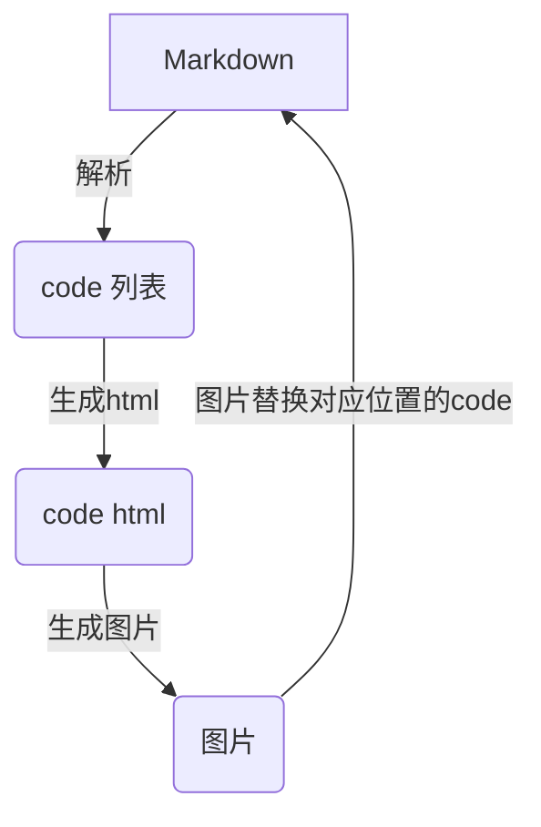

前几天写了《markdown 生成头条文章的一个思路》，周末就试了试。

先回顾一下思路，大致流程如下：



这里的三个关键点是：
1. 提取code
2. 把code 转换为html
3. 把html 生成图片
4. code 替换成图片

第一个很简单，只有用正则表达式就可以解决：

```python
_fenced_code_block_re = re.compile(r'''
    (?:\n+|\A\n?)
    ^```\s*?([\w+-]+)?\s*?\n # opening fence, $1 = optional lang
    (.*?)                  # $2 = code block content
    ^```[ \t]*\n           # closing fence
    ''', re.M | re.X | re.S)
```

> 这个正则来自 python-markdown2: https://github.com/trentm/python-markdown2

这个正则只匹配了 **```** 样式的代码，对于前边有四个空格的并没有做处理（也不想做处理，还是严格一点好）。

第二个也不麻烦，只需要把提取出的code 放到html 中，下面是一个html模板：

```html
<html>
<head>
   <link rel="stylesheet" href="http://media.gusibi.mobi/highlight/static/styles/atom-one-dark.css">
   <script src="http://media.gusibi.mobi/highlight/static/highlight.site.pack.js"></script>
   <script>hljs.initHighlightingOnLoad();</script>
</head>
<body style="width: 640px;">
<pre>
<code class="{{.Language}}">{{.Code}}</code>
</pre>
</body>
</html>`
```

这里有一个点是渲染html 页面的时候， 由于加载html 页面的工具都是get请求，这里我们需要先把code 数据保存起来。所以请求code 的html 页面分成了两步。

1. 存储code
2. 请求code 对应的html

在 html-server 服务中，实现了code 的存储和请求，使用方式如下：

```python
def code2html(code, language="plaintext"):
    data = {
        "code": code,
        "language": language
    }
    # 先存储代码
    resp = requests.post(Code2HtmlCreateUrl, json=data)
    if resp.status_code == 200:
        content = resp.json()
    else:
        content = resp.content
    return content["ID"]

```

第三个问题比较麻烦一点。

开始的时候是准备使用pyqt5 生成图片，但是它渲染html 的大小和直觉不太一致，API也比较复杂。最坑的是，一次生成多张图片有问题，最后改成了使用 的方式。

图片生成的代码比较简单，

```python
# -*- coding: utf-8 -*-

from selenium import webdriver
import time
import os.path
import multiprocessing as mp

def webshot(url, height, outfile):
    driver = webdriver.PhantomJS()
    driver.set_window_size(660, height)# 这里的宽高是先计算好指定的
    # driver.maximize_window()
    # 返回网页的高度的js代码
    js_height = "return document.body.clientHeight"
    try:
        driver.get(url)
        k = 1
        height = driver.execute_script(js_height)
        while True:
            if k*500 < height:
                js_move = "window.scrollTo(0,{})".format(k * 500)
                driver.execute_script(js_move)
                time.sleep(0.2)
                height = driver.execute_script(js_height)
                k += 1
            else:
                break
        driver.save_screenshot(outfile)
        print("save screenshot to {} success".format(outfile))
        time.sleep(0.1)
    except Exception as e:
        print(outfile,e)
```

第四个问题和第一个问题现在是关联的，操作方式是，找出code，处理然后直接替换：

```python
     def _fenced_code_block_sub(self, match):
        language = match.group(1)
        codeblock = match.group(2)
        image_path = code2img(codeblock, language)
        image_url, _ = upload27niu(image_path)
        return "\n\n\n\n" % image_url

    def _do_fenced_code_blocks(self, text):
        """Process ```-fenced unindented code blocks 
        ('fenced-code-blocks' extra)."""
        return self._fenced_code_block_re.sub(
            self._fenced_code_block_sub, text)
```

这么做虽然简单但是弊端也很明显，就是没有使用并发，脚本执行的慢。如果想提高速度，可以先把code 全找出来，然后使用多进程来处理。

代码我上传到了github，使用方式如下

使用方法

```bash
git clone git@github.com:gusibi/oneplus.git

cd oneplus

python plus.py -m [markdown_path] -n [outfile_path]
```

## 转换前后的效果

这是转换前：

https://github.com/gusibi/oneplus/blob/master/325.md

这是转换后：

https://github.com/gusibi/oneplus/blob/master/new_325.md


这个只是一个粗糙的优化方式，也只识别了代码，对于流程图，table 并没有适配，作为一个优化项之后再做吧。
------


**最后，感谢女朋友支持和包容，比❤️**

也可以在公号输入以下关键字获取历史文章：`公号&小程序` | `设计模式` | `并发&协程`


