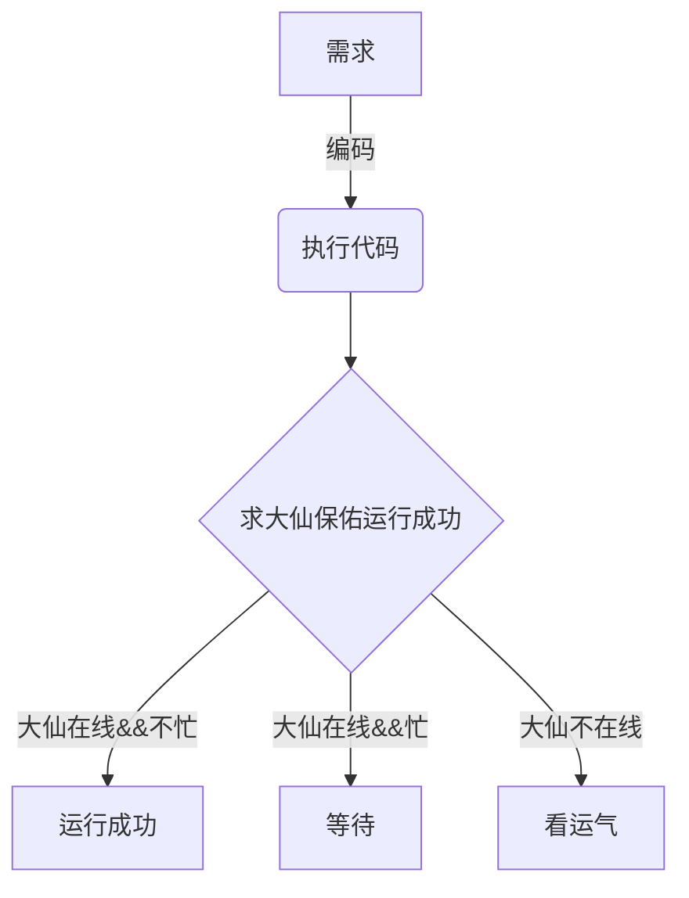
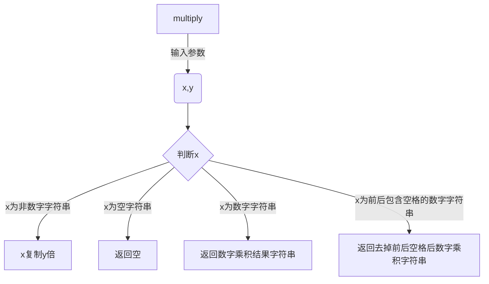

[TOC]

## 祈祷式编程

### 祈祷式编程

如果代码中包含以下代码


或者上线后进行这种活动


那么这种编程方式就是祈祷式编程。


用流程图表示基本就是这个样子。




祈祷式编程有什么危害呢？

1. 累，每次写完代码还需要再祈祷
2. 不受控，代码运行结果主要看运气，大仙忙的时候可能保佑不了

解决这个问题有好多种方法，单元测试是其中之一。

## 单元测试

### 什么是单元测试

> 单元测试是由开发人员编写的，用于对软件基本单元进行测试的可执行的程序。
> 单元（unit）是一个应用程序中最小的课测试部分。（比如一个函数，一个类

google 把测试分成小型测试、中型测试和大型测试。单元测试基本和小型测试的作用类似，但是通常也会使用mock或者stub 的方式模拟外部服务。


理想情况下，单元测试应该是相互独立、可自动化运行的。

**目的：** 通常用单元测试来验证代码逻辑是否符合预期。完整可靠的单元测试是代码的`安全网`，可以在代码修改或重构时验证业务逻辑是否正确，提前发现代码错误，减少调试时间。设计良好的单元测试某些情况下可以比文档更能反应出代码的功能和作用。

单元测试这么多优点为什么有人不喜欢写单元测试呢？

1. 单元测试太费时间了，对于编写单元测试不熟练的新手来说，编写单元测试可能比写代码的还费时间
2. 单元测试运行时间太长（这通常是单元测试设计不合理或者代码可测试性较差造成的
3. 祖传代码，看都看不懂怎么写单元测试（这个确实优点棘手。。可以考虑先给新代码加单元测试
4. 不会写单元测试

这篇文章主要关注第四个问题，如何写单元测试。

### 单元测试的结构

首先看一下单元测试的结构，一个完整的单元测试主要包括**Arrange-Act-Assert（3A）** 三部分。

* Arrange--准备数据
* Act--运行代码
* Assert--判断结果是否符合预期

比如我们要给下面这段代码（golang）加单元测试：

```go

func Add(x, y int) int {
	return x + y
}

```

单元测试代码如下：

```go
import "testing"

func TestAdd(t *testing.T) {
    // arrange 准备数据
	x, y := 1, 2
    // act   运行
	got := Add(x, y)
    //assert  断言
	if got != 3 {
		t.Errorf("Add() = %v, want %v", got, 3)
	}
}
```

### 如何编写好的单元测试

> 什么样的单元测试才是好的单元测试呢？

先看一个例子：


```go
package ut

import (
	"fmt"
	"strconv"
	"strings"
)

func isNumber(num string) (int, error) {
	num = strings.TrimSpace(num)
	n, err := strconv.Atoi(num)
	return n, err
}

func multiply(x string, y int) string {
    // 如果x 去除前后的空格后是数字，返回 数字的乘积
    //     比如 x="2" y=3 return "6"
    // 如果x 去除前后的空格后不是数字，则返回字符串的x的y倍 
    //     比如 x="a" y=2 return "aa"
	num, err := isNumber(x)
	if err == nil {
		return fmt.Sprintf("%d", num*y)
	}
	result := ""
	for i := 0; i < y; i++ {
		result = fmt.Sprintf("%s%s", result, x)
	}
	return result
}
```

测试代码可能是这个样子。

```go

// 测试方法的名字不直观，并不能看出具体要测试什么
func Test_multiply(t *testing.T) {
	type args struct {
		x string
		y int
	}
    // 一个测试方法中有太多的测试用例
	tests := []struct {
		name string
		args args
		want string
	}{
		{
			"return nil",
			args{
				"",
				2,
			},
			"",
		},
		{
			"return 2",
			args{
				"1",
				2,
			},
			"2",
		},
		{// 测试数据有点奇葩，不直观
			"return aaa",
			args{
				"aaaaaaaaaa",
				6,
			},
			"aaaaaaaaaaaaaaaaaaaaaaaaaaaaaaaaaaaaaaaaaaaaaaaaaaaaaaaaaaaa",
		},
	}
	for _, tt := range tests {
		t.Run(tt.name, func(t *testing.T) {
			if got := multiply(tt.args.x, tt.args.y); got != tt.want {
               // 数据错误的时候有明确标明测试数据，期望结果和实际结果，这一点还是有用的
				t.Errorf("multiply() = %v, want %v", got, tt.want)
			}
		})
	}
}

```

这个单元测试代码有什么问题呢？

1. 代码比较长（这里只列出来了三个用例，实际上并没有完整覆盖全部结果）
2. 测试方法如果出错了并不容易定位位置(三个测试数据都在一个方法，任何一个错误都会指向到同一个位置
3. 有个测试的数据比较长，不太能直观判断测试数据是否正确
4. 输入值并不完整，比如包含空格的数字字符串" 1" 、" 1 "、 "1 "并没有测试。


结合上面我们对**单元测试目的**的描述，一个好的单元测试应该满足以下几个条件：

1. 单元测试越简单越好，一个单元测试只做一件事
2. 对错误易于追踪，如果测试失败，错误提示应该容易帮我我们定位问题
3. 测试函数的命名符合特定的规则 `Test_{被测方法}_{输入}_{期望输出}`
4. 有用的失败消息
5. 输入简单且能够完整运用代码的输入
6. 测试边界值
7. 测试特殊情况

比如，上边的单元测试我们改成这样：

```go
// 测试特殊值 “空字符串”
func Test_multiply_empty_returnEmpty(t *testing.T) {
    // 用例简单，只包含输入、执行和判断 
	x, y, want := "", 1, ""
	got := multiply(x, y)
	if got != want {
       // 有效的失败消息
		t.Errorf("multiply() = %v, want %v", got, want)
	}
}

// 测试包含空格的数字 边界值
func Test_multiply_numberWithSpace_returnNumber(t *testing.T) {
	x, y, want := " 2", 3, "6"
	got := multiply(x, y)
	if got != want {
		t.Errorf("multiply() = %v, want %v", got, want)
	}
}
// 测试正常数据
func Test_multiply_number_returnNumber(t *testing.T) {
	x, y, want := "2", 3, "6"
	got := multiply(x, y)
	if got != want {
		t.Errorf("multiply() = %v, want %v", got, want)
	}
}
// 测试非数字字符 
func Test_multiply_String_returnString(t *testing.T) {
    // 输入简单的字符串就可以测试，没必要用太奇怪或者太长或者太大的数据数据
	x, y, want := "a", 3, "aaa"
	got := multiply(x, y)
	if got != want {
		t.Errorf("multiply() = %v, want %v", got, want)
	}
}
// 测试空格 边界值
func Test_multiply_space_returnSpace(t *testing.T) {
	x, y, want := " ", 3, "   "
	got := multiply(x, y)
	if got != want {
		t.Errorf("multiply() = %v, want %v", got, want)
	}
}
```

当然这个数据也并不完整，还可以再加入：

* 包含空格的非数字字符
* 数字右侧包含空格的字符串
* 数字两侧都有空格的字符串

既然好的单元测试需要能完整的测试代码，那么有什么方法可以保证单元测试可以完整覆盖被测代码呢？

基于代码路径进行分析编写单元测试是一个方法。

#### 单元测试路径

设计测试路径时可以使用流程图的方式来分析，拿上边`multiply`的例子进行分析，这段代码的路径如下：




当然，每个路径的测试数据并不是只有一种，比如`x为前后包含空格的数字字符串`这个路径中就包含三种情况：

* 左边有空格
* 右边有空格
* 两边都有空格


#### 单元测试数据

合理的设计测试数据非常重要，测试除了符合上边说的要简单直观以外还要着重考虑边界值。

设计测试数据通常是把可能的输入数据分成多个子集，然后从每个子集中选取具有代表性的数据作为测试用例。
比如一段代码的作用是计算个税，我们就应该按照个税不同的等级来设计测试数据，比如：

* 年收入0-36000部分
* 年收入36000-144000 部分
* 年收入144000-300000部分
* 年收入300000-420000部分
* ...


然后在这个子集的基础上在针对边界值做一些检查，比如36000、144000 等。

### 私有方法如何测试

通常情况下，如果私有方法在公有方法中有被调用，通过测试公有方法就已经可以间接测试到私有方法。

也有些私有方法写的不合理，比如私有方法没有被使用或者私有方法的功能和类的相关性不大，这个时候就建议把私有方法单独提取成新的函数或者类来测试。

### 外部服务如何测试

当然现实世界中的代码并不会这么简单，通常都会包含外部请求或者对于其它类的调用。
在编写单元测试时，对于外部依赖我们通常使用Mock和Stub的方式来模拟外部依赖。


Mock和Stub 的区别：

* Mock是在测试代码中创建一个模拟对象，模拟被测方法的执行。测试使用模拟对象来验证结果是否正确
* Stub是在测试包中创建一个模拟方法，用于替换被测代码中的方法，断言针对被测类执行。

下面是代码示例：

#### Mock

实际代码：

```go
//auth.go
//假设我们有一个依赖http请求的鉴权接口
type AuthService interface{    
    Login(username string,password string) (token string,e error)   
    Logout(token string) error
}
```
Mock代码：
```go
//auth_test.go
type authService struct {}
func (auth *authService) Login (username string,password string) (string,error){
    return "token", nil
}
func (auth *authService) Logout(token string) error{    
    return nil
}

```

在测试代码中使用 authService实现了AuthService 接口，这样测试时可以模拟外部的网络的请求，解除依赖。


> 这里使用的是golang 代码，golang 不支持重载，这样使用的问题是会产生大量重复的代码。
> 如果是python、java等支持重载的面向对象语言，可以简单的继承父类，只重载包含外部请求的代码就可以实现Mock的需求。

#### Stub


```go
package ut

func notifyUser(username string){
	// 如果是管理员，发送登录提醒邮件
}

type AuthService struct{}

func (auth *AuthService) Login(username string, password string) (string, error) {
    notifyUser(username)
	return "token", nil
}
func (auth *AuthService) Logout(token string) error {
	return nil
}
```


对于这段代码想要测试其实是比较困难的，因为Login 中调用了notifyUser，如果想测试这段代码：
* 一个方式是使用Mock的形式，定义authService 接口，然后实现接口 TestAuthService，在 TestAuthService Login中 替换掉notifyUser。这种做法改动比较大，同时重复代码也比较多（当然如果是python java等支持重载的语言可以只重载Login接口即可。
* 还有一种方法就是重构Login方法，把notifyUser 作为参数传入其中，这样，我们只需在测试代码中重新定义notifyUser，然后作为参数传入到Login即可模拟发送邮件提醒的功能。

第二种就是stub 的方式。

通过这个例子我们也可以看到，如果想要代码容易测试，代码在设计时就应该考虑可测试性。

### 编写可测试代码

> Writing Testable Code 中提到一个非常实用的观点：在开发时，多想想如何使得自己的代码更方便去测试。如果考虑到这些，那么通常你的代码设计也不会太差。

如果代码中出现了以下情况，那么通常是不易于测试的：

1. 在构造函数或成员变量中出现new关键字
2. 在构造函数或成员变量中使用static方法
3. 在构造函数中有除了字段赋值外的其它操作
4. 在构造函数中使用条件语句或者循环
5. 在构造函数中没有使用builder或factory方法，二十使用object graph来构造
6. 增加或使用初始化代码

这篇文章地址为：http://misko.hevery.com/attachments/Guide-Writing%20Testable%20Code.pdf 推荐阅读。

> 也可以在公号回复 「test」 获取pdf

## 总结

总结一下就是编写可测试代码，使用高质量单元测试（命名清晰、功能简单、路径完整、数据可靠）保证代码质量。

## 参考文章

* [搞定Go单元测试（一）——基础原理](https://juejin.im/post/5ce93447e51d45775746b8b0)
* [Guide Writing Testable Code](http://misko.hevery.com/attachments/Guide-Writing%20Testable%20Code.pdf)
* [Selective Unit Testing – Costs and Benefits](http://blog.stevensanderson.com/2009/11/04/selective-unit-testing-costs-and-benefits/)
* [版本上线拜哪个神仙比较灵验？](https://www.zhihu.com/question/52985744)


------


**最后，感谢女朋友支持和包容，比❤️**

也可以在公号输入以下关键字获取历史文章：`公号&小程序` | `设计模式` | `并发&协程`


